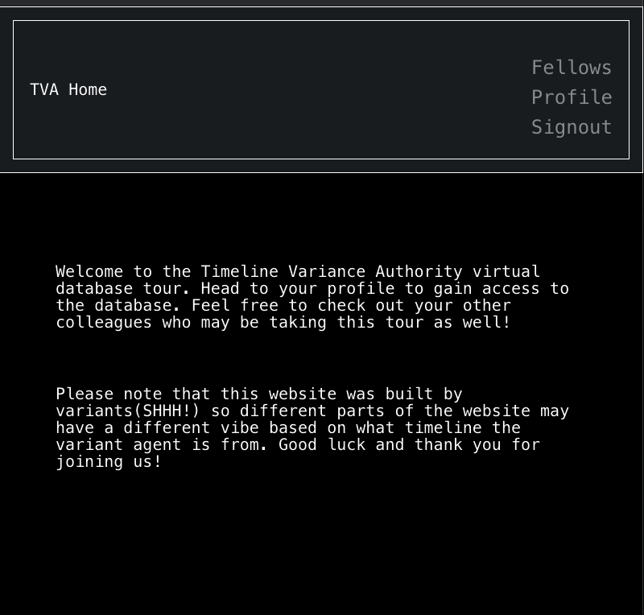
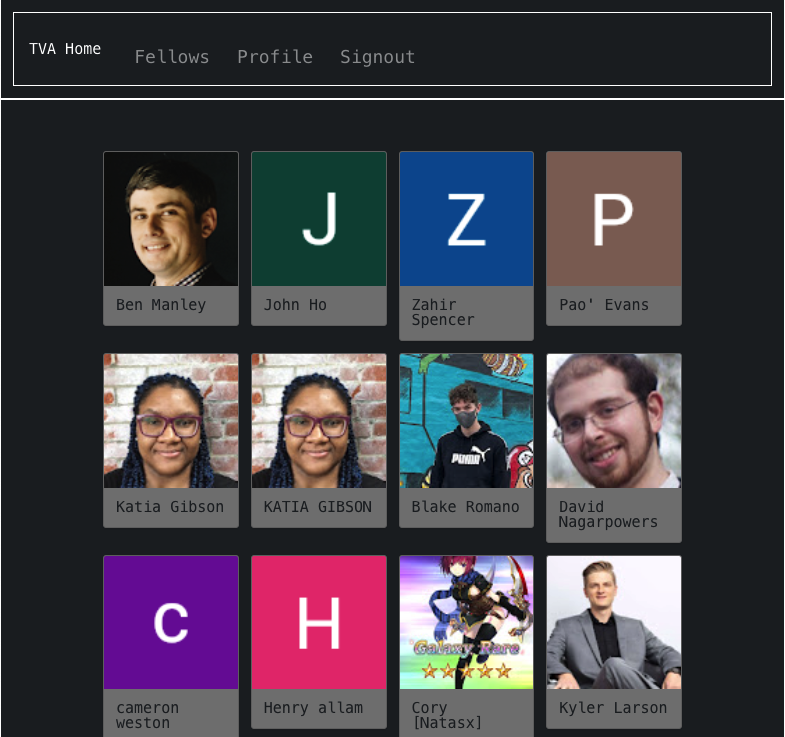
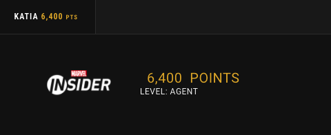

# TVA - Tracker - Tour
### [TVA-Tracker](https://tva-tracker.herokuapp.com/)
---
## What Does This Project Do?
### This COMPLETELY fictional training module trains users how to manage files and track variants that exist on multiple timelines through a simulation of how a typical TVA agent starts their day tracking variants. It is inspired by the Marvel comicbook and cinematic universe plotlines of What If?, where it is exposed that there are variants of our most beloved heros AND VILLAINS that have totally different stories in other universes and timelines. Any bugs in this app are due to timeline branch chaos! Thanks Loki!

## Link to Trello Board
https://trello.com/b/v60n4Keu/unit-2-project-board
****************************
## Screenshots

## Home Page

## Fellows

## Database

****************************
## Wins!
- ### I am really interested in mobile-first design, so I'm really glad that this website it 100% responsive...I think, and it's a first for me!
- ### I actually got all my functionality done before doing absolutely any styling. It is ...mostly worth it. It was more rewarding to actually make it all fancy at the END. I like the way it turned out!
- ### I am confident in my post grad experience building APIs for myself, with others, and for others. I actully cam up with two ideas for APIs that I wished existed. But. I now have 6,400 Marvel points and I am now at the level of Agent on the Marvel website. 
- 

- ### This app was tough to build because I had a lot of review of material to catch up on before I could start building. Once I got going, I got going. Once I realized that I burned a lot of time trying to "hack" Marvel's api with their strict requirements, I quickly adapted and just built my own. 
- ### Styling! I wanted to pay homage to a lot of my experiences as a database manager and the TVA having all their technology from the 70s because of ...variance! Hence, terminal for logging in but more futuristic as a simulation of traveling through time to a site built with a non-vintage UI.

## Lessons Learned not losses!
- ### Thanks to my instructor Thiago, I now know how to hash passwords even though I didn't get to use Marvel's API directly in my project. I ran a bunch of test calls in their interactive documentation to build my API.  

## Stretch goals
### Maps UI that visually tracks variants in various timelines
### passkey function to access the database via input-second login
### build on the api with more references to other "variants" from the comics aka more cards!
### connect to your fellows
### give agents points for number of variants tracked similar to marvel's api

## Credits
- ### I built the database file card slider following this tutorial: https://www.goingtointernet.com/2020/03/make-marvel-slider.html
- ### Marvel Fandom Wiki: https://marvel.fandom.com/wiki/Multiverse/Universe_Listing
- ### marvel API Documentation: https://developer.marvel.com/docs

## Languages and Tools Used
### HTML5, CSS3, ES6, Mongoose, Postman, mongoDB, Node.js and EJS. I also  used the following CSS and JS styling frameworks:

- #### google fonts
- #### terminal.css
___________________________
## Questions

### Feel free to contact Katia Gibson at katiacreator.github.io.

